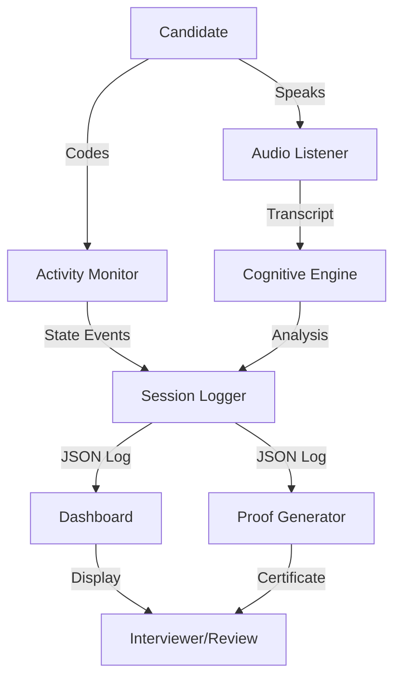

# GlassBox Architecture

## System Overview

GlassBox is a multi-component system that monitors, analyzes, and evaluates technical interviews in real-time.

## High-Level Architecture



## Component Details

### 1. Session Logger (`SessionLogger.py`)
**Role**: Central data store for all session events

**Responsibilities**:
- Create unique session ID
- Record state transitions (CODING/RESEARCHING/IDLE)
- Log AI analysis results
- Write to `session_log.json`
- Calculate final scores

**Thread Safety**: Uses `threading.Lock` for concurrent writes

### 2. Activity Monitor (`sensor.py`)
**Role**: Track candidate's window activity

**How it works**:
1. Polls active window title every 1 second
2. Classifies state based on keywords:
   - CODING: VS Code, PyCharm, .py files
   - RESEARCHING: Chrome, Firefox, Stack Overflow
   - IDLE: Other applications
3. Logs state changes to SessionLogger

**Dependencies**: `pygetwindow` (Windows only)

### 3. Audio Listener (`audio_listener.py`)
**Role**: Record and transcribe candidate's voice

**Pipeline**:
```
Microphone → 5s chunks → WAV → Google Speech API → Text → Cognitive Engine
```

**Features**:
- Auto-detects "WO Mic" device
- Filters out silence (volume threshold)
- Accumulates full transcript
- Saves complete audio to `session_audio.wav`

### 4. Cognitive Engine (`cognitive_engine/`)

#### Clarity Analyzer (`clarity_analyzer.py`)
**Role**: Evaluate explanation quality

**Modes**:
- **Real Mode**: Calls OpenAI GPT-4 API
- **Fake Mode**: Returns random scores (for testing)

**Evaluation Dimensions**:
1. **Coherence** (0-100): Logical flow
2. **Terminology** (0-100): Technical vocabulary
3. **Completeness** (0-100): Coverage of key aspects

#### System Prompt (`system_prompt.py`)
Defines evaluation criteria for the LLM. Uses strict JSON output format.

#### LLM Config (`llm_config.py`)
Loads configuration from `.env`:
- API key
- Model name
- Temperature
- Mode (real/fake)

### 5. Dashboard (`dashboard_app (1).py`)
**Role**: Web-based UI for session management

**Tech Stack**: Streamlit

**Features**:
- **Challenges Tab**: Start session, code editor, submit
- **Live Audit Tab**: Real-time metrics, timeline, clarity scores
- **Mock Login**: Simulated authentication
- **Session Control**: Start/stop backend process

**Data Flow**:
```
Session Started → Polls session_log.json → Displays metrics → User submits → Shows final results
```

### 6. Main Orchestrator (`main_role.py`)
**Role**: Coordinate all components

**Sequence**:
```
1. Initialize SessionLogger
2. Start Activity Monitor (thread)
3. Start Audio Listener (thread)
4. Wait for STOP_SESSION signal
5. Stop all threads
6. Save audio file
7. Run final analysis
8. Calculate scores
9. Finalize session
```

## Data Flow

### Session Start
```
Dashboard → Write STOP_SESSION (cleanup) → Launch main_role.py → Initialize threads
```

### During Session
```
Audio Listener ────→ Transcribe ────→ Cognitive Engine ────→ SessionLogger
Activity Monitor ───→ Classify State ──→ SessionLogger
                                         ↓
                                  session_log.json
                                         ↓
                                    Dashboard (auto-refresh)
```

### Session End
```
Dashboard → Write STOP_SESSION → main_role.py detects signal
                                        ↓
                                  Stop threads
                                        ↓
                                Save audio file
                                        ↓
                         Analyze full transcript with LLM
                                        ↓
                                Calculate final scores
                                        ↓
                            Write ended_at + summary
                                        ↓
                        Dashboard shows final results
```

## File Formats

### session_log.json
```json
{
  "session_id": "uuid",
  "candidate_id": "string",
  "started_at": 1234567890.123,
  "events": [
    {
      "ts": 0.0,
      "type": "STATE" | "CLARITY" | "FINAL_ANALYSIS",
      "payload": {...}
    }
  ],
  "ended_at": 1234567999.456 | null,
  "summary": {
    "hard_score": 0-100,
    "soft_score": 0-100,
    "verdict": "PASS" | "FAIL" | "PENDING"
  }
}
```

### session_audio.wav
- Format: WAV, 16-bit PCM
- Sample Rate: 44100 Hz
- Channels: Mono
- Source: Concatenated 5-second chunks

## Security & Privacy

- ⚠️ **API Key**: Stored in `.env`, never committed
- 🔒 **Session Data**: Local only, not uploaded
- 🎤 **Audio**: Saved locally, Google Speech API for transcription
- 🔐 **Authentication**: Mock only (no real credentials)

## Performance Considerations

- **CPU**: Activity monitor polls every 1s (low overhead)
- **Memory**: Audio buffered in RAM (~10 MB for 10-minute session)
- **Disk**: `session_log.json` grows ~1 KB per minute
- **API Costs**: $0.01-0.05 per session (GPT-4 calls)

## Deployment

**Current**: Local development only

**Future** (if productionized):
- Backend: FastAPI server
- Frontend: React dashboard
- Database: PostgreSQL for session history
- Queue: Celery for async LLM calls
- Auth: OAuth2 + JWT

## Technology Stack

| Component | Technology |
|-----------|------------|
| Frontend | Streamlit |
| Backend | Python 3.8+ |
| Audio | SpeechRecognition, sounddevice |
| LLM | OpenAI GPT-4 API |
| Window Tracking | pygetwindow |
| Data Format | JSON |

## Known Limitations

1. **Windows Only**: Activity monitor requires Windows
2. **WO Mic**: Hardcoded device name
3. **No Async**: Blocking audio/API calls
4. **No History**: Only one session at a time
5. **Temp Files**: Not cleaned up automatically
